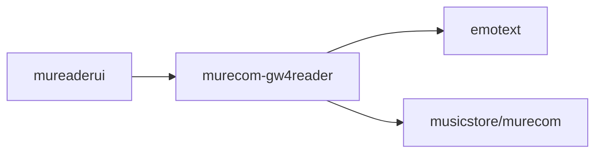

# murecom-gw4reader

This is a API gateway for mureader (mureaderui, specifically) to access the
murecom service and the emotext & emomusic services behind it.



## Usage

Run:

```sh
go run . -h
```

Request:

```sh
curl -X POST -d '{"CurrentPages": ["今天非常的开心高兴快乐"]}' http://127.0.0.1:8007/murecom
```

Response:

```json
{
   "Music" : {
      "Artist" : "Romansenykmusic",
      "CoverImage" : "",
      "SourceUrl" : "http://127.0.0.1:8080/bgm/audio/A_Cozy_Beat-Romansenykmusic-A_Cozy_Beat.mp3",
      "Title" : "A Cozy Beat",
      "TrackEmotion" : {
         "arousal" : 0.687146306037903,
         "valence" : 0.667694747447968
      }
   },
   "TextEmotion" : {
      "arousal" : 0.676040478085735,
      "valence" : 0.650237916024219
   }
}
```
