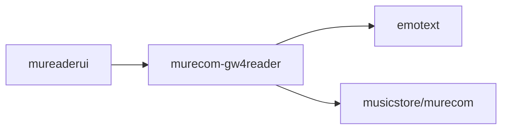

# murecom-gw4reader

This is a API gateway for mureader (mureaderui, specifically) to access the
murecom service and the emotext & emomusic services behind it.



## Usage

**Run**:

```sh
go run . -h
```

**Request**:

```sh
curl -X POST -d '{"CurrentPages": ["今天非常的开心高兴快乐"]}' http://127.0.0.1:8007/murecom
```

**Response**:

```json
{
  "Music": {
    "Artist": "Romansenykmusic",
    "CoverImage": "",
    "SourceUrl": "http://127.0.0.1:8080/bgm/audio/A_Cozy_Beat-Romansenykmusic-A_Cozy_Beat.mp3",
    "Title": "A Cozy Beat",
    "TrackEmotion": {
      "arousal": 0.687146306037903,
      "valence": 0.667694747447968
    }
  },
  "TextEmotion": {
    "arousal": 0.676040478085735,
    "valence": 0.650237916024219
  }
}
```

**Proxy musicstore/AudioFileStore**:

murecom-gw4reader （以下简称 gw）可以反向代理 musicstore/AudioFileStore 为音频文件提供的静态服务，以便 mureaderui 访问。

```sh
AUDIO_PROXIES='foo=http://127.0.0.1:6666/bar/audio/,fuzz=...' go run . -listen-addr='127.0.0.1:7777'
```

启用代理后，gw 会 "Hijack" murecom 的响应，检查其中的音频文件链接，
如果匹配上了，则替换为代理链接（`/` 开头的、gw 的 route path，加上 gw 的 host 来访问）：

```
# sourceUrl from murecom
http://127.0.0.1:6666/bar/audio/song.mp3

# response to client: replaced by gw
=> /audioproxy/foo/song.mp3
```

然后请求 `{listen-addr}/audioproxy/foo/song.mp3` 会反向代理到原来的 localhost 地址上：

```
# client request:
GET 127.0.0.1:7777/audioproxy/foo/song.mp3

# gw proxy it to the upstream:
GET http://127.0.0.1:6666/bar/audio/song.mp3
```
